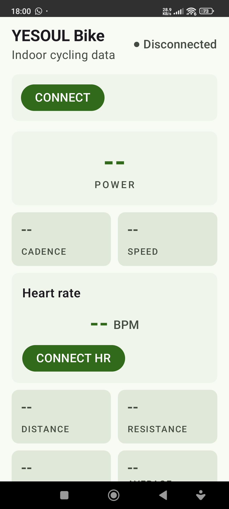
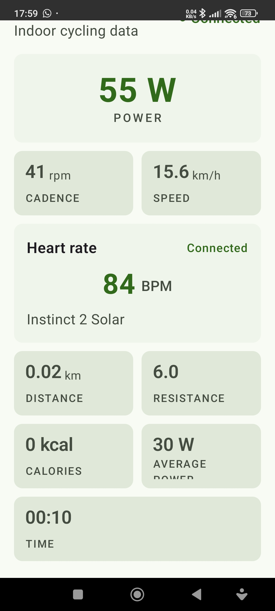

# OpenPedal

Version `0.3.2`.

Small native Android app for viewing live FTMS data from a YESOUL indoor bike
and a separate Bluetooth heart-rate monitor.

The app scans for the FTMS service, prefers a device whose name starts with
`YESOUL`, connects over `BluetoothGatt`, enables Indoor Bike Data (`0x2AD2`)
notifications, and displays the parsed measurements on one screen.
It can also scan for Heart Rate Service (`0x180D`) devices, connect to the
selected monitor independently, and display Heart Rate Measurement (`0x2A37`)
notifications alongside the bike data.

## Screenshots

<p align="center">
  
  
</p>

Build the Google debug variant with:

```sh
./gradlew testGoogleDebugUnitTest assembleGoogleDebug
```

Licensed under the GNU General Public License version 3.
